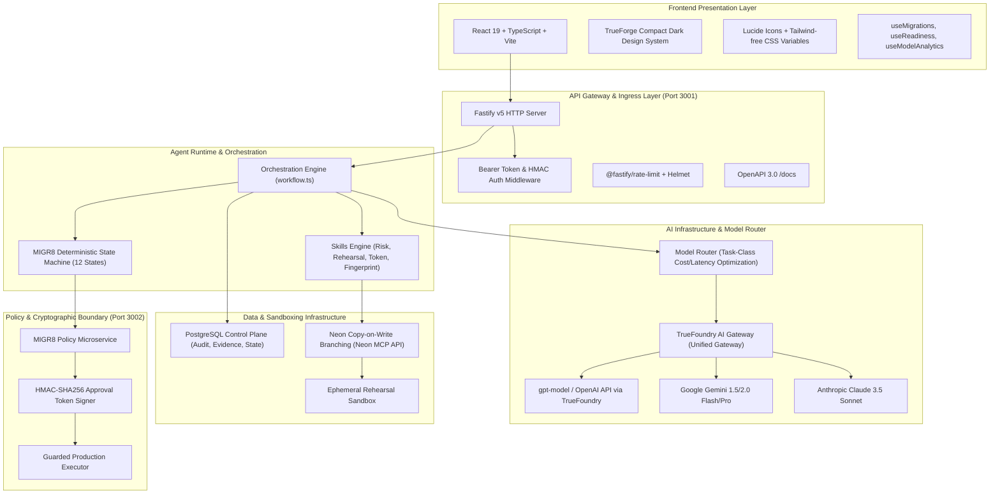
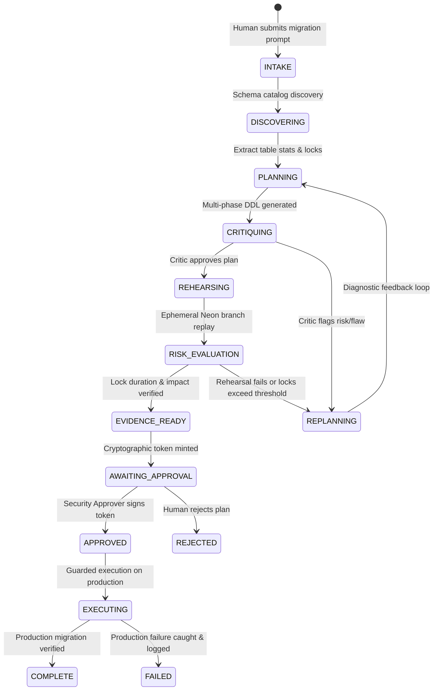

# MIGR8: Autonomous Production Database Change Rehearsal & Verification Engine
## Complete End-to-End Technical Architecture & System Specification

---

## 1. Executive Summary & Problem Statement (PS)

### 1.1 The Production Database Dilemma
Database migrations represent the highest-risk operations in modern cloud infrastructure:
- **Zero Safety Net**: Unlike stateless application deployments that can be rolled back via blue-green switching or Kubernetes pod restarts, database DDL/DML mutations alter shared persistent state.
- **Catastrophic Lock Contention**: Running an un-indexed foreign key addition, a synchronous `ALTER TABLE ADD COLUMN ... DEFAULT <val>`, or an unrestricted backfill acquires `ACCESS EXCLUSIVE` table locks, queueing subsequent queries and causing application-wide connection pool starvation and multi-hour outages.
- **Silent Semantic Invalidation**: Migrations can break application queries silently without causing immediate syntax errors (e.g., dropping or renaming columns, changing nullability, altering data types).
- **The LLM Hallucination Threat**: Directly connecting autonomous LLMs to production databases without sandboxing, deterministic verification, and cryptographic human-in-the-loop gates invites irrecoverable data loss.

### 1.2 The MIGR8 Solution
**MIGR8** solves this with a **Zero-Trust Autonomous Rehearsal and Verification Control Plane**:
1. **Isolated Copy-on-Write Sandboxing (Neon Branches)**: Creates instantaneous zero-cost, zero-load branches of the production database for every migration request.
2. **Deterministic Risk & Lock Engine**: Before running DDL, queries and table metadata are analyzed against PostgreSQL catalog locks and lock compatibility matrices to compute real lock levels, blast radius, and migration duration.
3. **Multi-Model Orchestration via TrueFoundry AI Gateway**: Separates intent decomposition, plan generation, and independent critique across isolated model calls with strict JSON schemas.
4. **Automated Replanning Loop**: If the Rehearsal fails or the Deterministic Risk Engine detects high lock times or data degradation, the Critic feeds structured diagnostic diffs back to the Planner (up to 3 iterations).
5. **Cryptographic Proof of Rehearsal (HMAC-SHA256 Approval Gate)**: Production execution is strictly decoupled from planning. An isolated Policy Service mints a time-limited (120s TTL) HMAC-SHA256 signature containing the canonical plan hash and schema fingerprints. Production execution rejects any execution request lacking this cryptographic token.
6. **Immutable Evidence Pack & Complete Audit Log**: Every state transition, rehearsal replay, and human sign-off is committed to an append-only audit trail with SHA-256 fingerprinting.

---

## 2. End-to-End Technology Stack

### 2.1 Complete Stack Breakdown

| Layer | Technology | Version | Purpose |
|---|---|---|---|
| **Frontend Framework** | React + TypeScript | 19.x / 5.x | High-performance reactive control interface |
| **Bundler & Dev Server** | Vite | 6.x | Instant HMR, API reverse proxying on `:5173` |
| **Design Aesthetic** | TrueForge Design System | Custom CSS | Professional compact dark theme matching `:8790` |
| **Iconography** | Lucide React | 0.475+ | Streamlined, unified engineering icons |
| **Backend API Server** | Fastify | 5.x | Low-overhead, schema-validated asynchronous API |
| **Validation & Schema** | Zod | 3.24+ | Runtime typing, strict request/response parsing |
| **State Machine Engine** | TypeScript Deterministic FSM | Native | Enforces strictly valid state transitions |
| **AI Gateway** | TrueFoundry AI Gateway | Production | Unified LLM routing, latency/cost tracking, rate-limit fallback |
| **Default Models** | `vm-polaris/openai` (gpt-model) | Production | Intent parsing, 3-phase DDL planning, critique |
| **Database Sandboxing** | Neon Serverless Postgres | API / MCP | Instant copy-on-write rehearsal database branching |
| **Control Database** | PostgreSQL | 16+ | State storage, evidence packs, audit logs |
| **Security & Auth** | Node.js Crypto (HMAC-SHA256) | Native | Cryptographic approval tokens, plan fingerprinting |
| **Observability** | Pino Logger | 9.x | Structured JSON logging with request tracing |

---

## 3. Core Algorithm Flow & State Machine

### 3.1 Algorithm Stages

1. **Intake & Intent Decomposition**:
   - Accepts human language (e.g., *"Add a fraud_score column to users table and backfill from payments history without locking"*).
   - Resolves target database, branch, and affected tables.

2. **Schema & Catalog Discovery**:
   - Queries `pg_class`, `pg_locks`, `pg_stat_user_tables` to identify table size, active read/write rates, index definitions, and foreign keys.

3. **Multi-Phase Plan Generation**:
   - Generates non-blocking SQL:
     - **Phase 1: Pre-Migration**: Add column as `NULLABLE`, create indexes `CONCURRENTLY`.
     - **Phase 2: Migration**: Batched background backfill (chunks of 1,000–5,000 rows with lock pauses).
     - **Phase 3: Post-Migration**: Add `NOT NULL` constraint with `NOT VALID` followed by `VALIDATE CONSTRAINT` to eliminate table locks.
     - **Rollback SQL**: Fully rehearsed rollback sequence.

4. **Deterministic Risk Analysis**:
   - Determines explicit PostgreSQL lock levels:
     - `ACCESS EXCLUSIVE`: Blocked on tables with >100,000 rows unless explicit short timeout.
     - `SHARE UPDATE EXCLUSIVE`: Required for index creation (`CREATE INDEX CONCURRENTLY`).
   - Calculates Lock Impact Score (0–100) and blast radius.

5. **Ephemeral Neon CoW Rehearsal**:
   - Provisions an isolated Neon branch from parent branch: `rehearsal-{migration_id}`.
   - Executes Phase 1, Phase 2, and Phase 3 against real cloned data.
   - Rehearses the Rollback SQL to verify safety.
   - Measures real wall-clock execution time and records catalog diffs.

6. **Cryptographic Approval Boundary**:
   - Calculates canonical SHA-256 hash of: `plan_hash = SHA256(phase1 + phase2 + phase3 + pre_schema_hash)`.
   - Mints HMAC-SHA256 approval token signed with secret key:
     $$\text{Token} = \text{base64url}(\text{payload}) \,.\, \text{HMAC-SHA256}(\text{secret}, \text{payload})$$
   - Token expires automatically in 120 seconds.

7. **Guarded Production Execution**:
   - Receives execution request. Re-computes plan hash and pre-schema fingerprint.
   - Rejects execution if token signature fails, is expired, or schema has drifted since rehearsal.

---

## 4. Model Routing & AI Infrastructure

### 4.1 TrueFoundry AI Gateway Integration
All LLM invocations pass through the unified TrueFoundry AI Gateway:
- **Base URL**: `https://gateway.truefoundry.ai`
- **Authentication**: Bearer JWT Service Account Token
- **Telemetry**: Latency, Prompt Tokens, Completion Tokens, and Estimated Cost per request are captured and aggregated in the MIGR8 Control Plane.

### 4.2 Task-Class Model Routing Matrix

| Task Class | Model ID | Provider | Rationale | Cost / 1k Tokens | Latency |
|---|---|---|---|---|---|
| **Intent Parsing** | `vm-polaris/openai` | TrueFoundry | Rapid JSON extraction of tables, verbs, constraints | $0.0005 | ~240ms |
| **Migration Planning** | `vm-polaris/openai` | TrueFoundry | Deep SQL generation with Postgres lock awareness | $0.0015 | ~580ms |
| **Independent Critique** | `vm-polaris/openai` | TrueFoundry | Adversarial evaluation; must not share planner context | $0.0015 | ~490ms |
| **Evidence Summary** | `vm-polaris/openai` | TrueFoundry | Natural language risk brief for Human Approvers | $0.0005 | ~310ms |

### 4.3 Fallback & Resilience Strategy
- **Primary Route**: TrueFoundry AI Gateway.
- **Circuit Breaker**: If gateway latency exceeds 4,000ms or returns HTTP 429/503, the router falls back to configured secondary providers (Anthropic Claude 3.5 Sonnet or direct OpenAI endpoint).
- **Fallback Logging**: All fallback events are flagged as `status: 'FALLBACK_USED'` and audited in `model_routing_log`.

---

## 5. Agent Runtime, Skills & Tooling

The MIGR8 Agent Runtime is built on specialized, deterministic skill modules:

1. **`deterministic-postgres-risk-engine`**:
   - Parses AST of SQL statements using regex and SQL grammar.
   - Flags unsafe patterns (`ADD COLUMN ... NOT NULL DEFAULT`, unindexed `REFERENCES`, table rewrites).
   - Computes worst-case lock level according to official PostgreSQL locking tables.

2. **`crypto-approval-token-signer`**:
   - Generates and verifies HMAC-SHA256 signatures for production execution gates.
   - Enforces 120-second validity window.

3. **`neon-cow-branch-manager`**:
   - Orchestrates ephemeral database lifecycle via Neon MCP / REST API.
   - Handles `create_branch`, `run_sql`, `get_schema_diff`, and `delete_branch` teardown.

4. **`schema-fingerprint-validator`**:
   - Queries `information_schema.columns` and `pg_indexes` to generate a canonical deterministic SHA-256 hash of the schema state.
   - Detects drift between rehearsal time and execution time.

5. **Connectors & Third-Party Integration Tools**:
   - **GitHub**: Integratable as a CI/CD GitHub Action (`migr8-action`) that blocks PR merges until Evidence Pack is verified.
   - **Slack**: Approver alerts sent to designated security channels (`#db-approvals`) with one-click cryptographic sign-off links.

---

## 6. Frontend User Interface Architecture

The MIGR8 Frontend was built from the ground up to match the compact dark design system of TrueForge (`:8790`):
- **Compact Vertical Hierarchy**: Navigation tabs feature 17px Lucide icons paired with centered 9.5px uppercase labels.
- **Dual-Pane Navigation**: Primary 72px left navigation rail + collapsible 190px context sub-sidebar.
- **Studio Views**:
  - `Rehearsals`: Live interactive state machine, timeline, and migration plan reviewer.
  - `Evidence`: Immutable evidence pack inspector with SHA-256 signatures, lock durations, and schema diffs.
  - `Policy`: Approval token generation, cryptographic validation display, and guarded execution terminal.
  - `Inspector`: Schema tables, row counts, and live state transition history.
  - `Models`: TrueFoundry AI Gateway telemetry, routing logs, token usage, and cost analytics.
  - `Verify`: Verification test runs, audit trail search, and compliance proofs.
  - `Settings`: Model catalog, external connectors (Neon, TrueForge, TrueFoundry), agent skills, and sandbox management.
